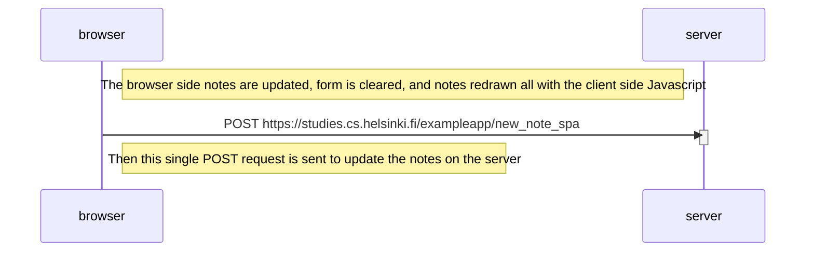

```mermaid
sequenceDiagram
participant browser
participant server

    Note right of browser: The browser side notes are updated, form is cleared, and notes redrawn all with the client side Javascript

    browser->>server: POST https://studies.cs.helsinki.fi/exampleapp/new_note_spa
    activate server
    deactivate server

    Note right of browser: Then this single POST request is sent to update the notes on the server

```
